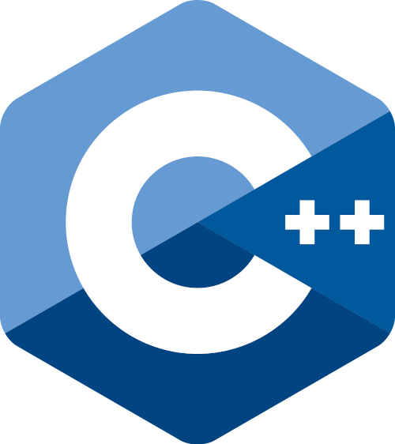

# C++ Programming

(The C++ logo endorsed by Standard C++)(***from wikipedia***)

### Based on the following inter alia udemy courses:

Learn C++ Programming -Beginner to Advance- Deep Dive in C++
https://www.udemy.com/course/cpp-deep-dive/

Mastering Data Structures & Algorithms using C and C++
https://www.udemy.com/course/datastructurescncpp/